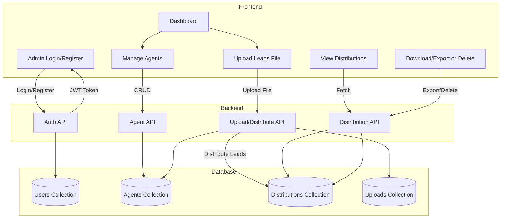

# MERN Agent Management System

Hey there! This is a project I built to manage agents and distribute leads among them. It's a full-stack app using MongoDB, Express, React, and Node (the classic MERN stack). If you want to get it running, just follow the steps below. No fluff, just what you need!


## What can you do with this?
- Register/login as an admin
- Add, edit, or remove agents
- Upload a CSV or Excel file with leads
- The app splits up the leads and assigns them to your agents
- You can see who got what, and download or delete distributions


## Tech Used
- Node.js, Express.js, MongoDB, Mongoose
- React.js, React Router, Axios, Toastify
- Multer, csv-parser, xlsx (for file uploads)


## How it all fits together (Workflow)



    A -->|Login/Register (Dashboard)| H
    B -->|Add Agents (Dashboard)| C
    D -->|Upload Leads File (Dashboard)| J
    F -->|View/Download/Delete Distributions (Dashboard)| K

## Getting Started (Setup)


### What you need first


### Backend (API)
1. Open a terminal and go to the backend folder:
   ```bash
   cd backend
   npm install
   ```
2. Copy `.env.example` to `.env` and fill in your MongoDB URI and a secret key.
3. Start MongoDB if it's not already running.
4. To seed the database with a demo admin and agents (optional):
   ```bash
   npm run seed
   ```
5. Start the backend:
   ```bash
   npm start
   ```

### Frontend (React app)
1. Open another terminal, go to the frontend folder:
   ```bash
   cd frontend
   npm install
   npm start
   ```
2. The app should open at [http://localhost:3000](http://localhost:3000)

- By default, it uses a local MongoDB. You can use MongoDB Atlas if you want—just update the URI in your `.env` file.


## How to use it

1. Start both backend and frontend servers (see above)
2. Go to [http://localhost:3000](http://localhost:3000)
3. Register as an admin (or use the demo credentials below)
4. Add some agents
5. Upload a CSV or Excel file with leads (columns: FirstName, Phone, Notes)
6. The app will split up the leads and assign them to your agents
7. You can see the distributions, download, or delete them


## Example file format

CSV:
```csv
FirstName,Phone,Notes
John,+1234567890,Follow up required
Jane,+1987654321,Interested in product
Mike,+1122334455,
```
Excel: Same columns, just save as .xlsx or .xls
- `GET /api/agents` — List agents
- `POST /api/agents` — Add agent
- JWT tokens for login
- Passwords are hashed
- File uploads are checked for type/size
- All routes are protected

## Project Structure (Quick peek)

```
mern-agent-management/
  backend/
    models/
    routes/
    middleware/
    uploads/
    server.js
    package.json
    .env
  frontend/
    public/
    src/
      components/
      context/
      services/
      App.js
      index.js
    package.json
- MongoDB not running? Start it up or check your URI.
- File upload fails? Check the format and size.

## Demo Credentials
- Email: `admin@example.com`
- Password: `admin123`


